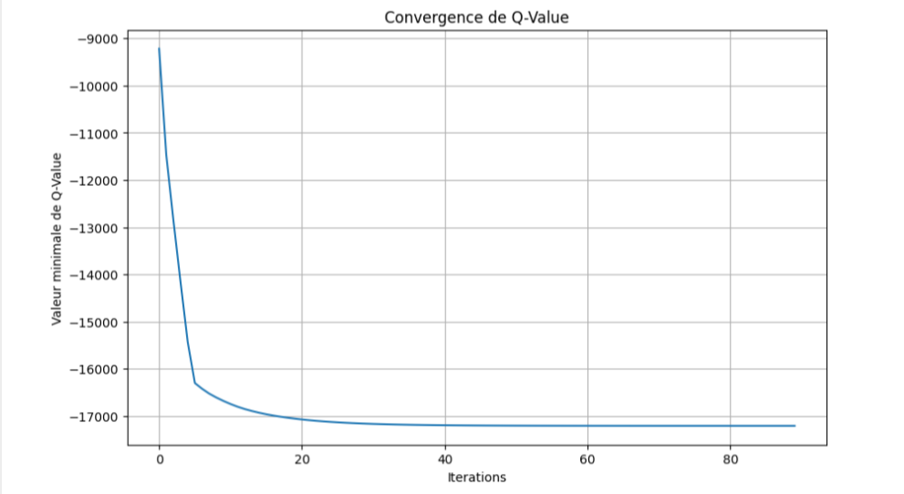

### Allocation dynamique des ressources dans le Cloud 
## Mise en situation : 
 Le système modélise un environnement de cloud computing où les machines virtuelles
 (VMs) sont allouées dynamiquement pour traiter des paquets arrivant suivant une distribution
 de Poisson. Nous avons limité le nombre de machines virtuelles à 5 au maximum. Pour définir
 la probabilité PA des arrivées des paquets, nous avons choisi la distribution de Poisson parce
 qu’elle est capable de décrire avec précision des événements indépendants se produisant à
 un taux moyen constant sur une période donnée. Dans ce contexte, lambda représente le
 taux moyen d’arrivées des paquets par unité de temps. C’est un paramètre clé qui définit la
 fréquence à laquelle les demandes ou les tâches arrivent au système cloud pour être traitées
 par les machines virtuelles. Tandis que la taille maximale du batch (grand nombre de paquets
 qui peuvent arriver en une seule fois dans votre système) est fixée à 5. La capacité totale du
 système est de 15 (nombre d’arrivées dans la file + nombre de machines virtuelles). Chaque
 machine virtuelle a un débit fixé à 1

 ## Modélisation de la MDP : 
  L’état du système est défini par un couple (m, n) où m est le nombre de clients dans le
 système et n est le nombre des machines virtuelles actives.- La taille de l’espace d’état est
 définie par (B+1)*(K+1), où B est la capacité du système et K est le nombre de machines
 virtuelles.- L’action sera choisie pour l’exploration dans les phases d’apprentissage par la
 méthode d’Epsilon-greedy. Les actions peuvent être : Activation, désactivation ou exécution
 de la machine virtuelle.- La taille de l’espace d’action est définie par (K+1) où K est le nombre
 maximum de machines virtuelles.- Le passage d’un état s à un état s’ pour une action donnée qui 
 genere une certaine fonction de récompense.

  ## Bellman : 
  Deux expérimentations ont été faites pour voir l'influence des paramétres: 
  1. Implémentation avec un facteur de discount = 0.9
     Visualisation des q-valeurs minimales
     

     La politique optimale :
      

 Il est noté que même avec la meilleure politique trouvée par l’algorithme, le coût associé reste très élevé.
 En effet, ces valeurs peuvent etre du à la facon avec laquelle Q est mise à jour, qui, en plus
 d’utiliser un gamma=0.9 (ce qui accorde une grande importance aux récompenses futures),
 ne prend pas en compte le taux d’apprentissage, ce qui signifie que la nouvelle information
 remplace complètement l’ancienne valeur Q. Ainsi, elle ne donne pas importance quant à la
 valeur actuelle et à l’état actuel.     
     
  3. Implémentation avec un facteur de discount = 0.5

   Visualisation des q-valeurs minimales
     

     La politique optimale :
      

Les valeurs minimales de q ont été améliorées par rapport à la première expérience. Cela
 peut être dû au fait que nous avons modifié Gamma, ce qui a conduit à des couts plus
 minimes. En effet, cela diminue l’impact des récompenses futures sur la prise de décision
 actuelle. Cependant, les dépenses demeurent assez élevées, ce qui nécessite des ajustements
 supplémentaires

## Sarsa : avec stratégie de choix d'action est Epsilon-greed 
1. Taux d'apprentissage fixe : 0.9 et 0.1
   Résultats pour un Taux d'apprentissage = 0.9 et différents valeurs de lambda
   (taux moyen d’arrivées de paquets par unité de temps) 
    

   Résultats pour un Taux d'apprentissage = 0.1 et différents valeurs de lambda
   (taux moyen d’arrivées de paquets par unité de temps)
    

2. Taux d'apprentissage variable :

   Visualisation des qvaleurs min :
   
   
On a constaté que la stratégie de la décroissance exponentielle du taux d’apprentis
sage a entraîné une amélioration significative des q-valeurs. Par conséquent, elle vise à réduire
 les dépenses et à converger vers des politiques plus efficaces. En effet, une valeur de (-55) a été
 obtenue à la fin, ce qui indique une amélioration par rapport à la situation où alpha est fixe   
## Q-learning : 
1. Résultats obtenus avec deux probabilités distincts :
 
 
